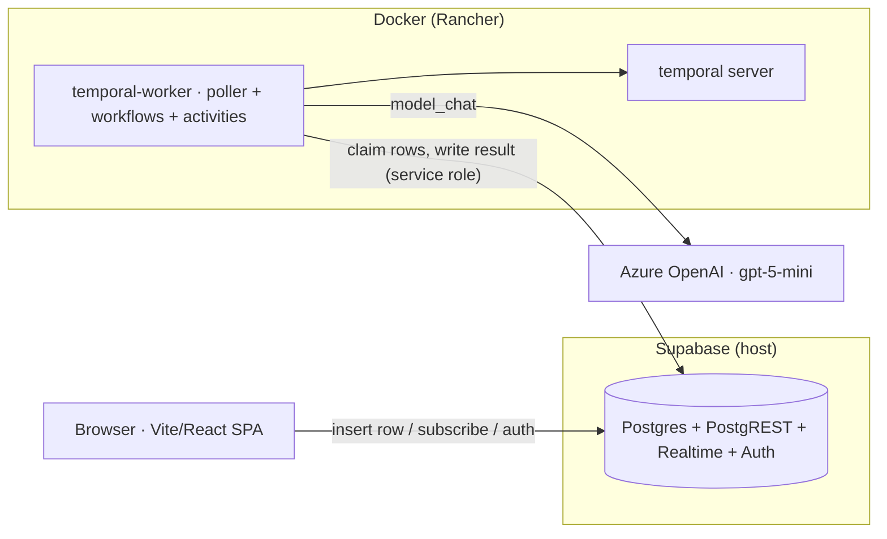

# Architecture Overview

Cross-cutting architecture docs for **Plan my studies** — the narrative that ties the
subsystems together. It complements, not replaces:

- [`docs/adrs/`](../adrs/) — **why** each decision was made (the binding record).
- [`docs/specs/`](../specs/) — the **detailed designs** for individual features.
- [`../Documentation_Index.md`](../Documentation_Index.md) — the top-level doc index.

Read this for the *shape of the whole system*; drop into the ADRs and specs for depth.

## What this system is

A Swiss higher-education advisor built as a **kernel + feature-plugin platform** on
Supabase + Temporal + Vite/React + Azure OpenAI. A small shared **kernel** provides the run
lifecycle, model access, live tracing, confidence scoring, source grounding, and auth; each
capability is a self-contained **feature** that registers itself (ADR-0008). Features today:
the **Program Evaluator** (`/evaluate`) and the **Study Planner** (`/plan`).

## The pages

| Page | What it covers |
|------|----------------|
| [Product architecture](./product-architecture.md) | **The main page** — run-row lifecycle, kernel↔feature boundary, cross-cutting concerns, data model |
| [Tech Stack](../TECH_STACK.md) | Every technology + version + why |
| [Testing Manifesto](../TESTING.md) | What we test, where, how; what CI can't reach |
| [ADRs](../adrs/) | The binding record of *why* each decision was made |
| [Specs](../specs/) | Detailed designs for individual features |
| [Onboarding](../../ONBOARDING.md) | Get a fresh clone running and make a first change |

> The stack ships hardened Helm charts under `charts/app/`, but runs **local-only** and keeps
> the deploy pipelines disabled — see [ADR-0004](../adrs/0004-deployment-posture-local-only.md).
> Owner-scoped auth (ADR-0007) is the gate for any multi-user/hosted use.
