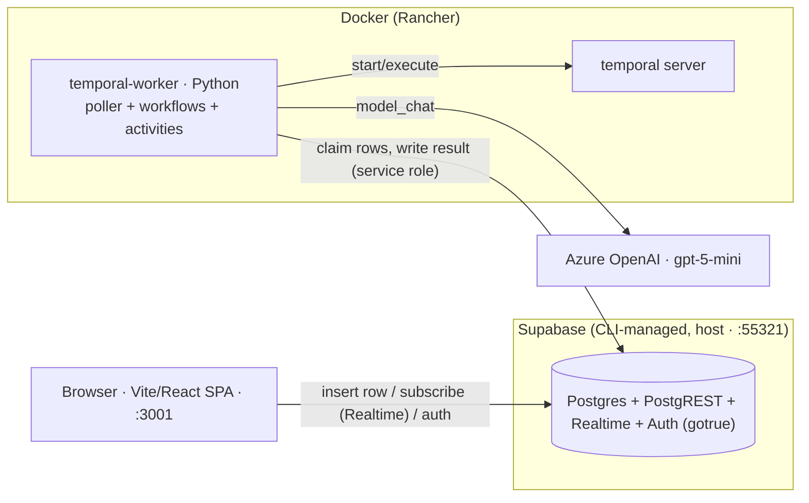
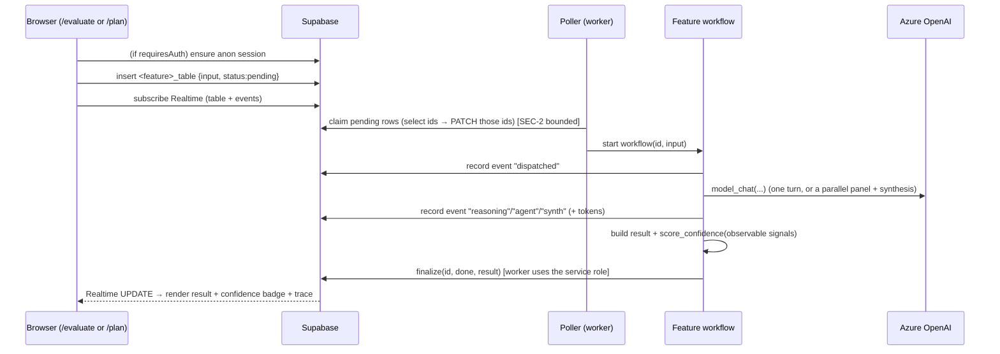

# Product Architecture

**AlpacAI** — a Swiss AI hub for learning. The repo is a **kernel + feature
plug-in platform**: a small shared kernel provides the run lifecycle, model access, live
tracing, confidence scoring, source grounding, and auth; each user-facing capability is a
self-contained **feature** that registers itself. For *why* each choice was made see the
[ADRs](../adrs/); for setup see [`ONBOARDING.md`](../../ONBOARDING.md); for the build recipe
see [`PLAYBOOK.md`](../PLAYBOOK.md).

> History: this stack began as a "Gains Check" fitness demo and was repurposed to the
> education platform (ADR-0008). Everything gains-related was removed.

---

## The one principle everything follows

**The browser only ever talks to Supabase.** No bespoke API server, no exposed worker port,
no CORS. Every feature is the same run-row loop:

1. The frontend **inserts a row** (`status: 'pending'`) into the feature's Supabase table.
2. A worker-side **poller** atomically claims pending rows (`pending → running`) and starts the
   feature's **Temporal workflow**.
3. The workflow orchestrates **activities** — the model call(s), then computes a result and a
   **confidence badge** — writing progress + the final result back to Supabase.
4. The frontend **subscribes via Supabase Realtime** and renders the trace and result live.

Locked in [ADR-0001](../adrs/0001-entity-insights-workflow-and-model-hosting.md); the plug-in
shape in [ADR-0008](../adrs/0008-education-platform-feature-plugin-architecture.md).

---

## Containers



The LLM is reached **only from the worker** (its credentials live in the worker env). The
browser uses the Supabase **anon key** (+ an auth session for gated features), never the
service-role or provider keys.

---

## Kernel ↔ feature boundary (ADR-0008)

```
temporal/src/
  kernel/                 # generic capabilities — knows nothing about any feature
    registry.py           #   FeatureManifest, ClaimSpec, build_workflows/activities/claims/routes,
                          #   apply_feature_flags (ADR-0010)
    confidence.py         #   score_confidence() — observable-signal badge (ADR-0009)
    sources.py            #   resolve_sources() / grounding_ratio() — curated allowlist
  features/
    registry.py           # FEATURES = [ ... ] — the single list worker/poller/frontend iterate
    <feature>/            # a self-contained plug-in
      manifest.py         #   FeatureManifest (workflow, activities, claim, route, flags)
      workflow.py         #   deterministic Temporal workflow
      activities.py       #   run-row finalize + trace-event writes (service role)
      tools.py            #   tool schemas, personas, source allowlist, pure result builder
```

**Dependency rule:** features depend on the kernel; the kernel never depends on a feature;
features never import one another (cross-feature data flows through run rows). The worker
(`worker.py`) and poller (`poller.py`) build their registration/claim lists from the registry,
so **adding, removing, or toggling a feature touches only that feature's package + one registry
line** — never the worker/poller bodies. (Proven: gains was removed as a one-line registry
change; the evaluator and planner were added the same way.)

Frontend mirrors this: `frontend/src/features/registry.ts` lists features; the launcher and
header nav (`routes/index.tsx`, `routes/__root.tsx`) render from it; each feature is a
file-based route lazy-loaded as its own chunk.

---

## Request lifecycle (a feature run)



---

## Cross-cutting concerns

- **Confidence badge (ADR-0009).** Every result carries a tier — 🟢 well-grounded / 🟡 partial /
  🔴 speculative — computed by `kernel.confidence.score_confidence()` from **observable** signals
  (grounding coverage against the source allowlist, input completeness, source count), **never**
  the model's self-report.
- **Source grounding.** Features declare a curated allowlist; `kernel.sources.resolve_sources`
  drops any link not on it, so a student never sees an invented URL.
- **Auth + owner-scoped RLS (ADR-0007).** Run tables can be owner-scoped (`user_id = auth.uid()`,
  authenticated-only) or open-anon. The worker writes with the service role (bypasses RLS).
- **Per-feature auth gate (ADR-0011).** A feature declares `requires_auth` / `requiresAuth`; the
  frontend ensures an (anonymous) Supabase Auth session before use **iff** the feature requires
  it. This flag **must match the table's RLS posture**.
- **Feature flags (ADR-0010).** `FEATURES_ENABLED` (worker) / `VITE_ENABLED_FEATURES` (frontend)
  are comma-separated key allowlists that toggle features without code edits.

---

## Features

| Feature | Route | Table (RLS) | requiresAuth | Shape |
|---|---|---|---|---|
| **Program Evaluator** | `/evaluate` | `program_evaluations` (owner-scoped) | true | one forced-tool model turn → fit assessment + suggested study options + confidence |
| **Study Planner** | `/plan` | `study_plans` (owner-scoped) | true | multi-agent **panel** (curriculum + study-skills) in parallel → head-advisor **synthesis** → plan + how-to-study + confidence |

Both are Swiss higher-ed: institution types University / UAS (Fachhochschule) / PH; sources from
a curated official-Swiss allowlist (swissuniversities, orientation.ch, SERI, ETH/EPFL/UZH …).

---

## Data model

Each feature owns its timestamped migration and two tables:

| Table | Written by | Purpose |
|---|---|---|
| `<feature>` (`program_evaluations`, `study_plans`) | browser insert → worker finalize | one run: `input` jsonb, `status` (`pending→running→done/error`), `result` jsonb, `user_id` (owner) |
| `<feature>_events` | worker | ordered trace (dispatched → reasoning/agent/synth → finalized) with per-hop token usage |

`result` is JSON, so adding fields needs no migration. Owner-scoped tables carry
`user_id uuid default auth.uid()` with `auth.uid() = user_id` policies; events are owner-scoped
via a join to their parent run.

---

## Observability & testing

- **Live trace:** the `*_events` tables give a per-hop, token-annotated view of every run,
  surfaced in the UI stepper — the primary runtime observability.
- **Tests:** see [`TESTING.md`](../TESTING.md) — pure kernel/tool units + Temporal workflow tests
  (time-skipping env, mocked activities) + live RLS checks. CI fails if the suite disappears
  ([ADR-0003](../adrs/0003-testing-strategy.md)).

## Deployment

**Local-only** ([ADR-0004](../adrs/0004-deployment-posture-local-only.md)) — Rancher Desktop +
the Supabase CLI. Hardened Helm charts exist under `charts/app/` but are not deployed; owner-
scoped auth (ADR-0007) is the gate for any multi-user/hosted use.
