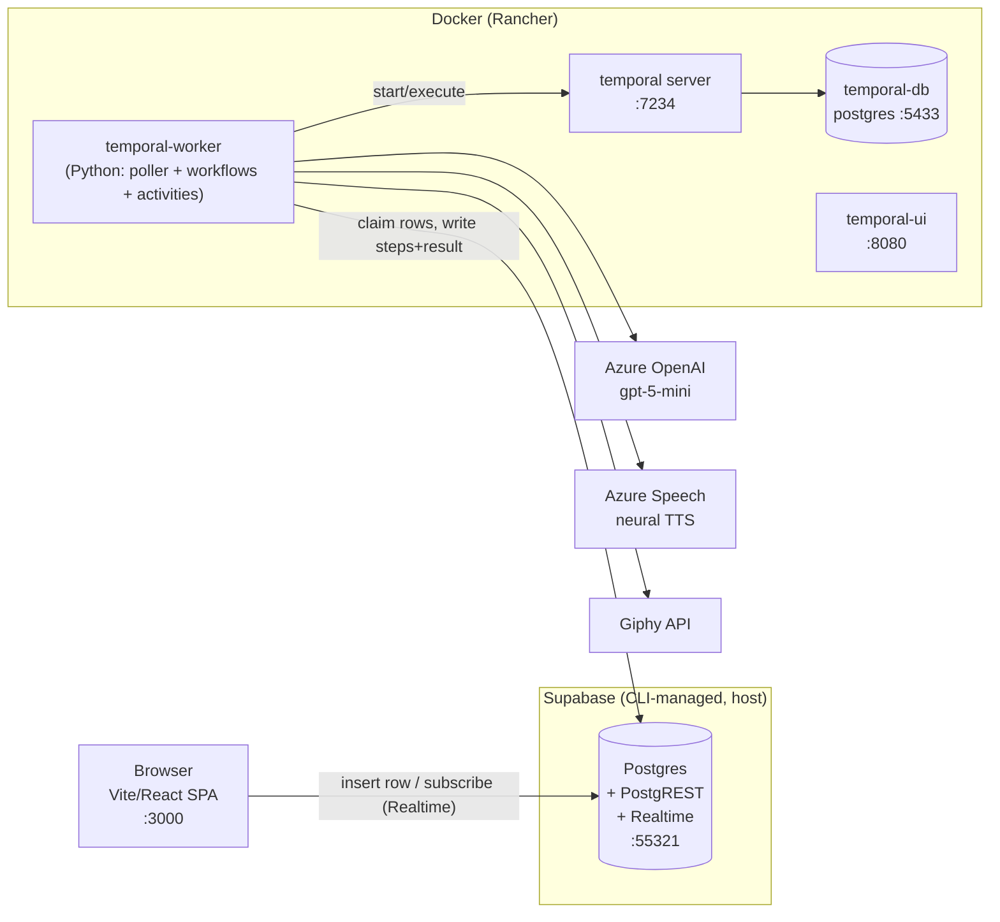

# Product Architecture

> **Note (2026-07-08):** the repo was trimmed to **Gains-only** — see
> [ADR-0006](../adrs/0006-trim-to-gains-only-minimal-repo.md). The **Entity Insights** sections
> below are kept as historical reference; the live app is **Gains Check** (check + multi-agent
> plan). The lifecycle, substrate, and patterns described here still apply.

The technical shape of the application: how a click in the browser becomes a durable,
tool-using model run, and how the result streams back. For *why* these choices were made,
see the [ADRs](../adrs/); for onboarding, see [`ONBOARDING.md`](../../ONBOARDING.md).

---

## The one principle everything follows

**The browser only ever talks to Supabase.** There is no bespoke API server, no exposed
worker port, no CORS. Every feature is the same loop:

1. The frontend **inserts a row** (`status: 'pending'`) into a Supabase table.
2. A worker-side **poller** atomically claims pending rows (`pending → running`) and starts a
   **Temporal workflow**.
3. The workflow orchestrates **activities** — the model call, tools, TTS — and writes progress
   + a final result back to Supabase.
4. The frontend **subscribes via Supabase Realtime** and renders steps and the verdict as they land.

This keeps the attack/serving surface tiny, reuses Realtime for streaming, and puts the
non-deterministic work behind Temporal's durability and retries. It was locked in
[ADR-0001](../adrs/0001-entity-insights-workflow-and-model-hosting.md).

---

## Containers



External dependencies are all reached **from the worker** (never the browser): Azure OpenAI
(the model), Azure Speech (spoken verdict), Giphy (GIFs). Their secrets live in the worker's
environment, not in client code.

---

## Request lifecycle (Gains Check, guided engine)

```mermaid
sequenceDiagram
    participant B as Browser (/gains)
    participant S as Supabase
    participant P as Poller (worker)
    participant W as GainsCheckWorkflow
    participant M as Azure OpenAI
    participant G as Giphy / Azure Speech

    B->>S: insert gains_checks {input, status:pending}
    B->>S: subscribe Realtime (gains_checks + gains_events)
    P->>S: PATCH status pending→running (atomic claim)
    P->>W: start workflow(check_id, input)
    W->>S: record_gains_event "dispatched"
    W->>W: pick_legend(input) → closest legend
    W->>S: record_gains_event "legend"
    loop bounded rounds (forced submit_verdict)
        W->>M: model_chat(messages, TOOLS, tool_choice=submit_verdict)
        M-->>W: tool call: submit_verdict{passed, fail_kind, ...}
        W->>S: record_gains_event "reasoning" (+ token usage)
    end
    W->>G: fetch_verdict_gif(passed, fail_kind) ; synthesize_speech(line, style)
    W->>S: record_gains_event "tool" / "speech" / "finalized"
    W->>S: finalize_gains(check_id, done, result)
    S-->>B: Realtime UPDATE → render verdict + trace + play audio
```

The **agentic engine** (`input.mode = "agentic"`) uses the same skeleton but a genuinely
different loop — see [Engines](#gains-check-two-engines) below.

---

## Components

### Frontend (`frontend/`)
- **Vite + React + TanStack Router** (file-based routes). Most pages are driven by a
  declarative **JSON UI engine** (a component registry in `src/engine/`), but the two agentic
  features are **custom routes**: `src/routes/insights.tsx` and `src/routes/gains.tsx`.
- Talks to Supabase via `supabase-js` using the **anon key** (never the service-role key).
- Subscribes to `postgres_changes` for live step/verdict updates and backfills any rows that
  landed before the subscription was ready.
- `/gains` renders: the engine toggle + explainer, persona picker, the live **request-trace
  stepper** (auto-scrolling, with per-hop token usage), the verdict card (flashing headline,
  GIF, plays the neural-TTS clip or falls back to `speechSynthesis`), and the
  "You vs a legend" comparison.

### Supabase (`supabase/`)
- Postgres + PostgREST + Realtime + Auth, run by the **Supabase CLI** (`supabase start`), not
  docker-compose. Migrations in `supabase/migrations/`.
- **RLS + API-role grants** are explicit in each migration (the base template omitted the
  `anon`/`authenticated`/`service_role` grants — added here so PostgREST works).
- Tables are published to the `supabase_realtime` publication so the UI can subscribe.

### Poller (`temporal/src/runs/poller.py`)
- Runs inside the worker process. Every ~2s it **atomically** flips `pending → running` for
  each feature's table (a single `PATCH ... status=eq.pending` returning the claimed rows, so
  two workers can't double-claim) and starts the matching workflow. This is the DB→Temporal
  bridge; its cost is a few seconds of trigger latency (accepted in ADR-0001).

### Temporal (`temporal/`)
- **Server** (`temporalio/auto-setup`) + its **Postgres** + a **UI** + our **Python worker**.
- The worker (`src/worker.py`) registers the workflows and activities and runs the poller loop
  alongside `worker.run()` on task queue `main`.

### Workflows (`temporal/src/workflows/`) — deterministic orchestration only
- `EntityInsightWorkflow` — bounded tool-use loop: the model calls read-only Supabase tools
  (`get_entity`, `get_entity_facts`) then `submit_insight`; each step is recorded; a validated
  structured result is written.
- `GainsCheckWorkflow` — the coach. Dispatches on `input.mode` to the guided or agentic path
  (below). Both finalize a result even on failure (no bare errors reach the UI).

### Activities (`temporal/src/activities/`) — all non-determinism lives here
- `insights.model_chat(messages, tools, max_completion_tokens, tool_choice)` — one model turn;
  returns `{content, tool_calls, finish_reason, usage}`. **Reused by both features.**
- `insights.run_tool` — dispatches the read-only data tools.
- `gains.fetch_verdict_gif`, `gains.pick_legend`, `gains.search_gif`, `gains.synthesize_speech`,
  `gains.record_gains_event`, `gains.finalize_gains`.

### Model client (`temporal/src/agents/model_client.py`)
- Wraps the `openai` SDK's `AzureOpenAI` against deployment `gpt-5-mini` (a reasoning model:
  uses `max_completion_tokens`, no temperature).
- **Entra-first with API-key fallback** (`AZURE_OPENAI_AUTH=auto`): tries
  `DefaultAzureCredential`; on an auth error falls back to the key and remembers it. Same call
  site whether keyless or keyed (ADR-0001). `openai` is pinned `<2` (v2 dropped the
  `azure_ad_token_provider` construction path).

---

## Data model

| Table | Written by | Purpose |
|---|---|---|
| `entities`, `entity_facts` | seed/migrations | The domain data the Insights agent reads |
| `insight_runs` | browser (insert) → worker (finalize) | One Insights request + its structured result |
| `insight_steps` | worker | Per-step trace for the Insights UI |
| `gains_checks` | browser (insert) → worker (finalize) | One Gains Check request (`input` incl. `persona`, `mode`) + `result` |
| `gains_events` | worker | Ordered pipeline trace (dispatched → legend → reasoning → tool → speech → finalized), with token usage, for the stepper |

`insight_runs` / `gains_checks` carry the `pending → running → done/error` status the poller
and Realtime hang off of. Result payloads are JSON columns, so adding fields (e.g. `mode`,
`fail_kind`) needs no migration.

---

## Gains Check: two engines

Selectable per run via `input.mode`; **Guided** is the default. The trade-off (reliability vs
autonomy) is recorded in [ADR-0002](../adrs/0002-gains-check-guided-vs-agentic-engine.md).

| Aspect | **Guided** (`_execute`) | **Agentic** (`_execute_agentic`) |
|---|---|---|
| Model's role | One **forced** `submit_verdict` call — classifies pass/fail against rules written in the prompt | Free reasoning; `submit_verdict` **not** forced |
| Tools | none exposed to the model | a real `search_gif` tool the model calls when/how it wants |
| GIF | chosen by code from a curated library (guaranteed Ronnie/Arnold on a pass) | the model picks the search terms and the resulting URL |
| Legend | nearest-neighbour **math** (`pick_closest_legend`, on realistic weight/BF scales) | the model picks a rival from a roster and writes the comparison |
| Headline / spoken line | curated meme quote (overrides model text on a pass) | the model writes them |
| Voice style | persona → style map | the model chooses the `mstts` express-as style |
| Loop | ~1 round | genuine reason → search → decide (multiple rounds/searches) |
| Failure floor | fun "RUN IT BACK" fallback verdict if the model never submits | same |

Both share the persona system (Gym Bro / Drill Sergeant / Wholesome), the `not_tracking` vs
`slacking` failure nuance, and the curated GIF fallback so a themed GIF always shows.

---

## Observability & testing

- **Live trace:** `gains_events` / `insight_steps` give a per-hop, token-annotated view of each
  run, surfaced directly in the UI stepper — the primary runtime observability.
- **Tests:** `temporal/tests/` — pure-logic unit tests + Temporal workflow tests (time-skipping
  env, mocked activities) asserting orchestration, not the model. CI runs them and fails if
  they vanish ([ADR-0003](../adrs/0003-testing-strategy.md)).

## Deployment

The app is **local-only** today; it is not hosted anywhere. The intended path if revisited is
Azure Container Apps + Supabase Cloud; the template's AKS/Helm deploy workflows remain
disabled. See [ADR-0004](../adrs/0004-deployment-posture-local-only.md).
